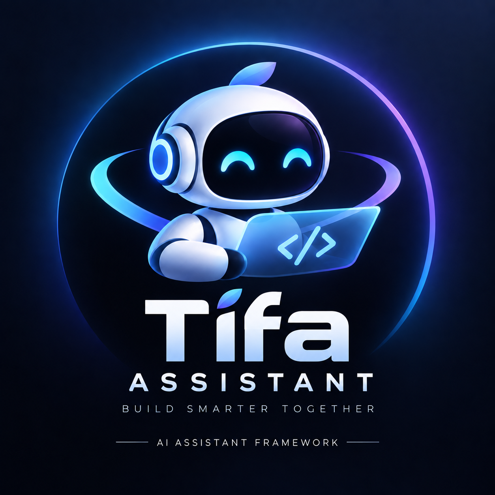

# Tifa AI

[](https://github.com/tungpastry/tifa-assistant-framework/actions/workflows/ci.yml)
[](https://github.com/tungpastry/tifa-assistant-framework/actions/workflows/release.yml)
[](https://github.com/tungpastry/tifa-assistant-framework/releases/latest)
[](https://github.com/tungpastry/tifa-assistant-framework/blob/main/LICENSE)
[](https://github.com/tungpastry/tifa-assistant-framework/blob/main/package.json)
[](https://github.com/tungpastry/tifa-assistant-framework/blob/main/package.json)
[](https://github.com/tungpastry/tifa-assistant-framework/blob/main/package.json)
[](https://github.com/tungpastry/tifa-assistant-framework/search?l=typescript)



**One Framework, Every Assistant Experience**

Tifa AI is the product identity for the `tifa-assistant-framework` repository, a local-first foundation for building streaming AI assistants with voice jobs, provider routing, guarded data access, and SaaS-ready contracts.

It runs without PostgreSQL, Redis, object storage, auth, or cloud provider keys by default. Optional SaaS components are scaffolded behind explicit environment flags.

## Core Capabilities

- Floating `TifaWidget` assistant UI.
- Streaming-first chat through Server-Sent Events.
- Non-streaming chat fallback.
- Local persistent chat sessions.
- Cache-first async voice jobs.
- Local TTS worker with heartbeat.
- Standard Piper local voice provider.
- LLM provider gateway with an Ollama-compatible provider.
- Safe PostgreSQL connector scaffold.
- Guarded Text-to-SQL planning scaffold.
- Tenant, usage, audit, and SaaS schema contracts.
- Healthcheck for local runtime, model endpoint, voice provider, worker state, and optional SaaS services.

## Tech Stack

- Node.js `20.9.0` or newer
- Next.js `16.3.4` with Turbopack
- React `19.3.0`
- TypeScript
- TailwindCSS
- Framer Motion
- Ollama-compatible local LLM endpoint
- Standard Piper local TTS

## Stable Local APIs

| Method | Endpoint | Purpose |
| --- | --- | --- |
| `POST` | `/api/tifa` | Non-streaming assistant chat |
| `POST` | `/api/tifa/stream` | SSE streaming assistant chat |
| `POST` | `/api/voice/jobs` | Create cache-first voice job |
| `GET` | `/api/voice/jobs/{jobId}` | Read voice job status |
| `GET` | `/api/voice/jobs/{jobId}/audio` | Fetch generated WAV audio |
| `GET` | `/api/health` | Local runtime and optional dependency health |

## Runtime Layout

```text
runtime/
├─ logs/
├─ audio_cache/
│  ├─ <cache_key>.wav
│  └─ <cache_key>.json
├─ tts_jobs/
│  └─ <job_id>.json
├─ chat_sessions/
│  ├─ session_<uuid>.json
│  └─ session_<uuid>.messages.jsonl
└─ tts_worker_heartbeat.json
```

## Install

```bash
git clone https://github.com/tungpastry/tifa-assistant-framework.git
cd tifa-assistant-framework
cp .env.example .env
npm ci
bash scripts/prepare-runtime.sh
```

## Environment

```env
TIFA_TIMEZONE=Asia/Ho_Chi_Minh
TIFA_RUNTIME_DIR=runtime
HOST=0.0.0.0
PORT=3100
TIFA_BASE_URL=http://127.0.0.1:3100

TIFA_RUNTIME_MODE=local
TIFA_SAAS_MODE=0
TIFA_LOCAL_FIRST=1
TIFA_DEFAULT_TENANT_ID=local
TIFA_DEFAULT_ASSISTANT_ID=tifa-assistant
TIFA_DEFAULT_LOCALE=en-US

OLLAMA_URL=http://127.0.0.1:11434
TIFA_API_URL=http://127.0.0.1:11434/api/generate
TIFA_MODEL=gemma3:1b
TIFA_TIMEOUT_MS=20000
TIFA_PROMPT_PATH=prompts/TIFA_RUNTIME.md
TIFA_LLM_ROUTING_POLICY=local-first
TIFA_LLM_PROVIDER=ollama
TIFA_LLM_FALLBACK_ORDER=ollama,qwen,openai,gemini

OPENAI_API_KEY=
OPENAI_MODEL=gpt-4o-mini
GEMINI_API_KEY=
GEMINI_MODEL=gemini-1.5-flash
QWEN_API_KEY=
QWEN_API_URL=https://dashscope-intl.aliyuncs.com/compatible-mode/v1
QWEN_MODEL=qwen-plus

PIPER_BIN=/home/nexus/piper-env/bin/piper
PIPER_MODEL=/home/nexus/piper/voices/en_US-libritts-high.onnx
PIPER_TIMEOUT_MS=10000
```

## Development

```bash
npm run dev
```

Use another port:

```bash
PORT=3202 npm run dev
```

## Production

```bash
npm run build
npm run start
```

Ubuntu systemd templates are available in `deploy/systemd`; see
[Local Systemd Deployment](docs/LOCAL_SYSTEMD_DEPLOYMENT.md).

Run the local TTS worker:

```bash
npm run tts:worker
```

Process queued jobs once:

```bash
npm run tts:worker:once
```

## Validation

```bash
git diff --check
npm run check:exports
npm run check:package-layout
npm run check:packages
npm run check:core-package
npm run lint
npm run build
npm run check
npm run audit
npm run audit:prod
npm run smoke:api
npm run test:e2e
node --check scripts/tts-worker.mjs
npm run tts:worker:once
```

Pull requests and pushes to `main` run the public
[`ci-required`](https://github.com/tungpastry/tifa-assistant-framework/actions/workflows/ci.yml)
check. Version tags run the public
[`Release`](https://github.com/tungpastry/tifa-assistant-framework/actions/workflows/release.yml)
workflow, which verifies and packages `@tifa-assistant/core` without publishing
it to npm.

Optional live smoke:

```bash
RUN_LIVE_SMOKE=1 npm run smoke:api
```

## Browser E2E

Playwright `1.63.0` covers the Tifa widget in desktop and mobile Chromium. Install
the managed browser once, then run the deterministic UI suite:

```bash
npm run playwright:install
npm run test:e2e
```

Target an already running development or production deployment by setting its
base URL. The deployment suite is read-only and validates health plus the
Piper-only voice provider contract:

```bash
PLAYWRIGHT_BASE_URL=http://192.168.1.30:3205 npm run test:e2e
PLAYWRIGHT_BASE_URL=http://192.168.1.30:3205 npm run test:e2e:deploy
```

On Ubuntu, install Chromium and its operating-system dependencies with:

```bash
npm run playwright:install:ubuntu
```

## Module Boundaries

- `lib/tifa-core`
- `lib/tifa-runtime`
- `lib/tifa-provider-gateway`
- `lib/tifa-voice`
- `lib/tifa-data-connectors`
- `lib/tifa-widget`

See [Module Boundaries](docs/MODULE_BOUNDARIES.md),
[P5 SaaS Extraction Plan](docs/P5_SAAS_EXTRACTION_PLAN.md), and
[Consuming Repositories Migration Guide](docs/CONSUMING_REPOS_MIGRATION.md).

## Workspace Pilot

The first npm-publishable pilot package is `@tifa-assistant/core`.
The source of truth remains `lib/tifa-core`; `packages/core` re-exports that
boundary for package validation and npm publishing.

See [P8 Core Workspace Pilot](docs/P8_CORE_WORKSPACE_PILOT.md) and
[P9 Core Package Publish](docs/P9_CORE_PACKAGE_PUBLISH.md).

## SaaS Mode

SaaS mode is scaffolded but disabled by default:

```env
TIFA_RUNTIME_MODE=local
TIFA_SAAS_MODE=0
TIFA_LOCAL_FIRST=1
TIFA_PG_ENABLED=0
TIFA_REDIS_ENABLED=0
TIFA_OBJECT_STORAGE_ENABLED=0
TIFA_TEXT_TO_SQL_ENABLED=0
```

See [SaaS Mode](docs/SAAS_MODE.md).

## License

MIT
